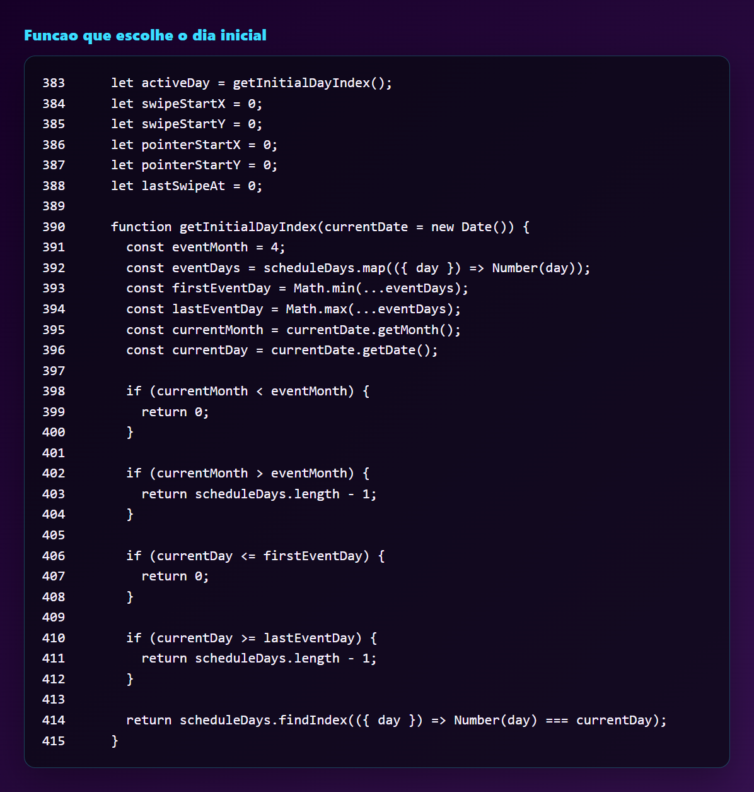

# Abertura automatica das atracoes do dia

Esta nota documenta o teste feito na pagina `/atracoesdia/` para que o modal abra diretamente no dia correspondente da programacao.

## Como funciona

A implementacao nao usa biblioteca externa e tambem nao usa hashmap. O comportamento foi feito com uma funcao simples em JavaScript chamada `getInitialDayIndex()`.

O fluxo e este:

1. A programacao continua dentro do array `scheduleDays`.
2. Ao carregar a pagina, `activeDay` nao comeca mais fixo em `0`.
3. Agora `activeDay` recebe o retorno de `getInitialDayIndex()`.
4. A funcao le a data atual com `new Date()`.
5. Ela compara mes e dia atual com os dias cadastrados em `scheduleDays`.
6. O retorno e o indice do dia que deve aparecer primeiro.

Se a data atual estiver antes do evento, abre no primeiro dia. Se estiver dentro do periodo, abre no dia correspondente. Se ja passou do ultimo dia, abre no ultimo dia da programacao.

## Print do codigo

## Print do teste atual

Para validar o comportamento antes do Sao Joao real, o teste temporario troca os dias `19` e `20` por `13` e `14`, e ajusta o mes de referencia para maio. Assim, em 14/05/2026, a pagina abre diretamente no segundo dia.

